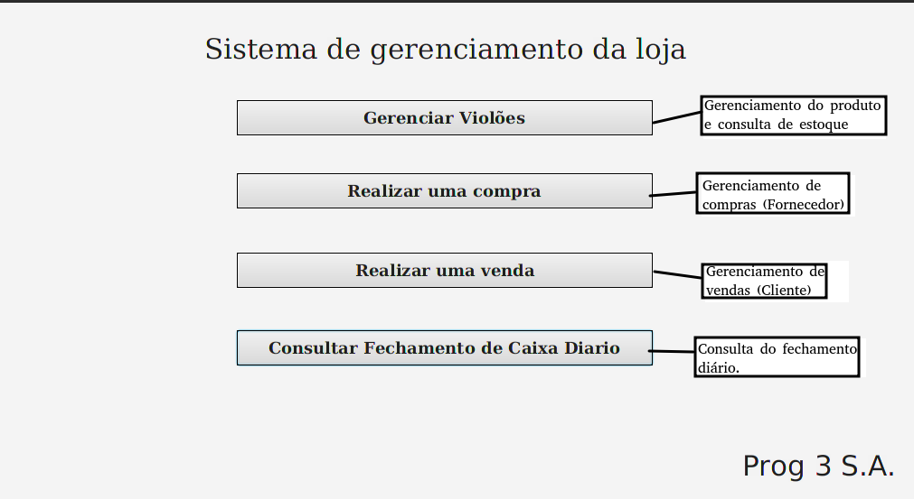

## Introdução:

Projeto requisitado pelo professor de programação como requisito para conclusão de disciplina.

### Problema proposto: Sistema de comércio

#### O sistema deve:

- Controle de estoque 1 pra 1 (o que compra revende);
- Não pode editar o estoque (compro pra aumentar e vendo pra diminuir);
- Tela de consulta do estoque;
- Tela de fechamento de caixa diário (Listar as vendas , listar compras e listar saldo (vendas-compras));

### Padrão de projeto utilizado:
- MCV (Model–view–controller);

### Softwares utilizados:
- Java 11;
- Gusion SceneBuilder 18;
- Postgres;

## Instruções:

